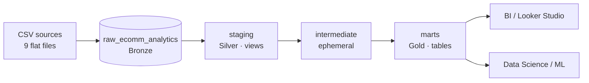

# Olist E-Commerce Analytics — Analytics Engineering on BigQuery + dbt

End-to-end analytics engineering project on the **Brazilian E-Commerce Public Dataset by Olist**, built on **Google BigQuery** with a **Medallion-style architecture** and **dbt**. It covers raw ingestion, modular staging with data quality testing, and a dimensional semantic layer designed for BI and data science.

## Overview

The dataset contains ~100K orders placed between **September 2016 and October 2018** across a Brazilian marketplace. This project turns 9 flat-file sources into a tested, documented, analytics-ready model.

Key facts from data profiling:
- **99,441** orders · **96,096** unique customers · **112,650** order line items · **3,095** sellers
- **~93%** on-time delivery rate (median 10 days from purchase to delivery)
- **R$13.6M** GMV · 71 product categories · 27 Brazilian states

## Architecture



- **Bronze (raw):** Python loads each CSV into BigQuery with a `loaded_ts_utc` audit column.
- **Silver (staging):** one model per source — trimming, casing normalization, type casting, surrogate keys, docs and tests. No business logic.
- **Intermediate:** business rules (review dedup, geolocation centroids, customer identity resolution, order enrichment).
- **Gold (marts):** conformed dimensions and fact tables in a star schema.

## Tech stack

| Layer | Tools |
|---|---|
| Ingestion | Python (pandas, google-cloud-bigquery) |
| Transformation | dbt-core, dbt-bigquery |
| Warehouse | Google BigQuery |
| Orchestration *(planned)* | Airflow + Astronomer Cosmos |

## Source data

| Source | Rows | Grain |
|---|--:|---|
| `raw_orders` | 99,441 | one row per order |
| `raw_customers` | 99,441 | one row per customer_id (order-level) |
| `raw_order_items` | 112,650 | order_id + order_item_id |
| `raw_order_payments` | 103,886 | order_id + payment_sequential |
| `raw_order_reviews` | 99,224 | one raw review record (duplicates by design) |
| `raw_products` | 32,951 | one row per product |
| `raw_sellers` | 3,095 | one row per seller |
| `raw_geolocation` | 1,000,163 | one geolocation observation (zip prefix not unique) |
| `raw_product_category_name_translation` | 71 | one row per category |


Download them from the [Kaggle dataset](https://www.kaggle.com/datasets/olistbr/brazilian-ecommerce) and place them in `Ingestion/`.


## Data model (target semantic layer)

**Conformed dimensions:** `dim_customers` (grain: `customer_unique_id`), `dim_products`, `dim_sellers`, `dim_geography` (zip-prefix centroids), `dim_date`.

**Fact tables:**

| Fact | Grain | date | customers | products | sellers | geography |
|---|---|:-:|:-:|:-:|:-:|:-:|
| `fct_order_items` | order line item | ✓ | ✓ | ✓ | ✓ | ✓ |
| `fct_orders` | order | ✓ | ✓ | — | — | ✓ |
| `fct_payments` | payment sequence | ✓ | ✓ | — | — | — |
| `fct_reviews` | review (deduped, 1 per order) | ✓ | ✓ | — | — | — |

## Data quality & testing

Tests run at both source and model level: `unique`, `not_null`, `relationships` (FK integrity), `accepted_values`, and `dbt_utils.unique_combination_of_columns` for composite grains. Known data quirks (duplicate `review_id`, non-unique zip prefixes) are documented and handled downstream rather than masked.

## Project structure

```
ecomm_analytics_project/
+-- Ingestion/              # CSV files and raw load notebook
+-- docs/                   # Data model notes and KPI definitions
+-- macros/                 # dbt macros
+-- models/
|   +-- staging/
|   |   +-- sources.yaml    # Raw source definitions
|   |   +-- schema.yaml     # Staging docs and tests
|   |   +-- stg_*.sql       # Source-aligned cleaning models
|   +-- intermediate/
|       +-- int_*.sql       # Business logic and enrichment models
+-- seeds/                  # Empty for now
+-- dbt_project.yml
+-- packages.yml
+-- package-lock.yml
+-- README.md
```
## Roadmap

- [x] Understanding data sources (9 sources)
- [x] Raw ingestion (multiple sources → BigQuery)
- [x] Staging layer (cleaning, casting, surrogate keys, tests, docs)
- [x] Intermediate layer 
- [ ] Marts (dimensions + fact tables, star schema)
- [ ] Incremental models with partitioning & clustering on facts
- [ ] Airflow orchestration
- [ ] Ready to leverage data applying machine learning and BI developing.